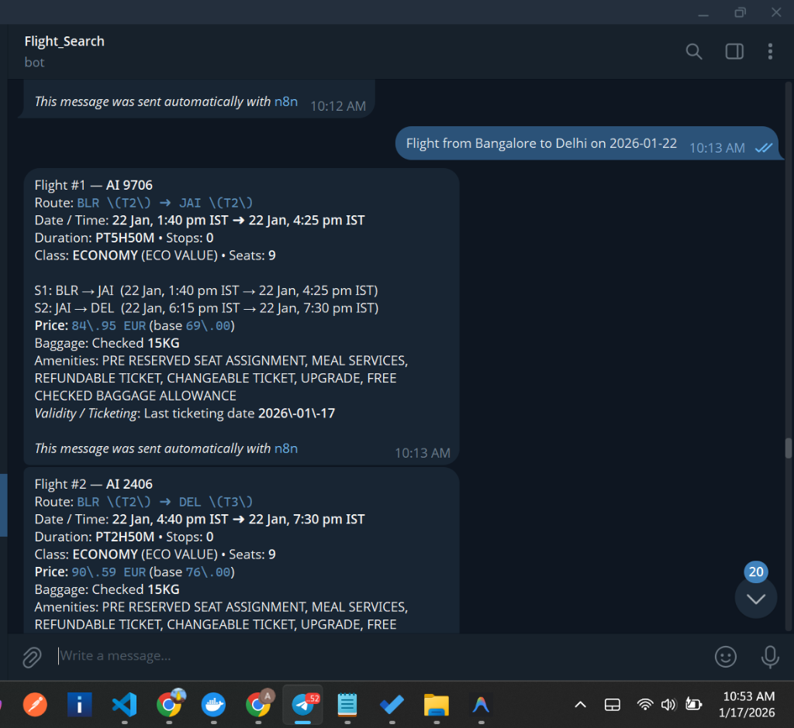
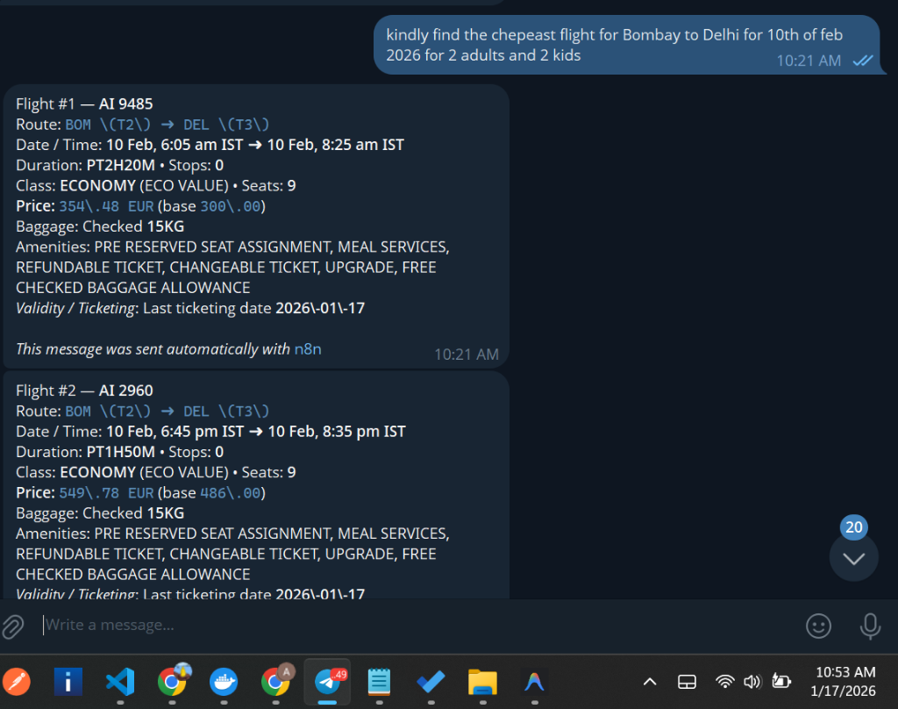
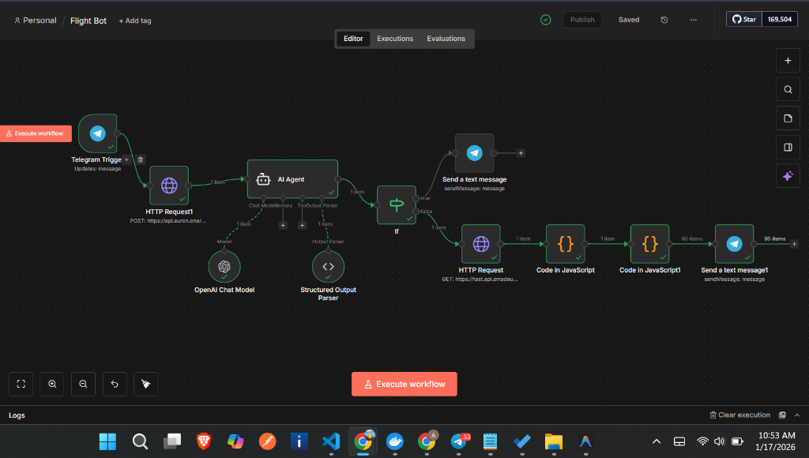

# ✈️ AI Flight Search Telegram Bot

A powerful, AI-driven Telegram bot built on **n8n** that allows users to search for real-time flight offers using natural language. The bot leverages a multi-stage AI pipeline to filter queries and the **Amadeus API** to fetch the most accurate flight data.

## 🚀 Features

*   **Natural Language Processing**: Search for flights just like you're talking to a travel agent (e.g., *"Find the cheapest flight from Bombay to Delhi for 10th of Feb 2026 for 2 adults and 2 kids"*).
*   **Dual-Stage AI Filtration**:
    *   **Euron API (GPT-4.1 Nano)**: Performs the initial extraction and filtration of user queries into a standardized format.
    *   **Internal AI Agent (GPT-4.1 Mini)**: Refines the extracted data into a structured JSON payload for the Amadeus API.
*   **Real-Time Flight Data**: Connects directly to **Amadeus Flight Offers Search API** to provide live pricing, availability, and flight details.
*   **Rich Telegram UI**:
    *   **MarkdownV2 Formatting**: Clean, readable flight details.
    *   **Multi-Segment Support**: Displays layovers and connecting flights (S1, S2, etc.).
    *   **Detail-Rich**: Shows flight numbers, IATA codes, terminals, duration, seat availability, prices (Total/Base), and baggage info.
    *   **Interactive Buttons**: Includes "Book this flight" and "More details" inline buttons.
*   **Intelligent Validation**: Automatically detects missing information (like travel dates or destination) and asks the user for clarification before searching.

## 📸 Screenshots

### Telegram Bot in Action
| Search Example 1 | Search Example 2 |
| :---: | :---: |
|  |  |

## 🛠 Tech Stack

*   **Automation Platform**: [n8n](https://n8n.io/)
*   **Messaging**: [Telegram Bot API](https://core.telegram.org/bots)
*   **AI Models**: 
    *   OpenAI GPT-4o Mini (via n8n AI Agent)
    *   GPT-4.1 Nano (via **Euron API**)
*   **Flight Data**: [Amadeus For Developers API](https://developers.amadeus.com/)
*   **Logic**: JavaScript (n8n Code Nodes)

## 🔄 Workflow Architecture

1.  **Trigger**: User sends a message to the Telegram Bot.
2.  **Filtration (Euron API)**: The message is sent to Euron's Chat Completion endpoint to extract `ORIGIN`, `DESTINATION`, `DATE`, and `PASSENGERS`.
3.  **Structuring (AI Agent)**: An n8n AI Agent uses a Structured Output Parser to convert the filtered text into a precise JSON search payload.
4.  **Decision**: An `If` node checks if the extraction was successful. If data is missing, it prompts the user; otherwise, it proceeds.
5.  **Data Retrieval**: The `HTTP Request` node calls the Amadeus API with the structured parameters.
6.  **Processing**: JavaScript nodes parse the raw API response and calculate local times (IST), format prices, and handle baggage strings.
7.  **Delivery**: Results are sent back to the user as a series of beautifully formatted Telegram messages.

## ⚙️ Configuration

To run this workflow, you need to configure the following credentials in n8n:
*   **Telegram API**: Your bot token from `@BotFather`.
*   **Euron API Token**: For the initial AI filtration stage.
*   **Amadeus API**: Client ID and Client Secret for Flight Search.
*   **OpenAI API**: For the internal AI Agent and Structured Parser.

---
*Created with ❤️ using n8n and Generative AI.*

